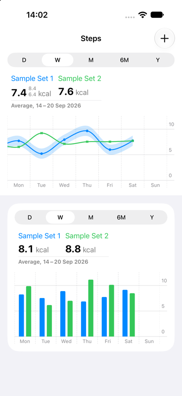
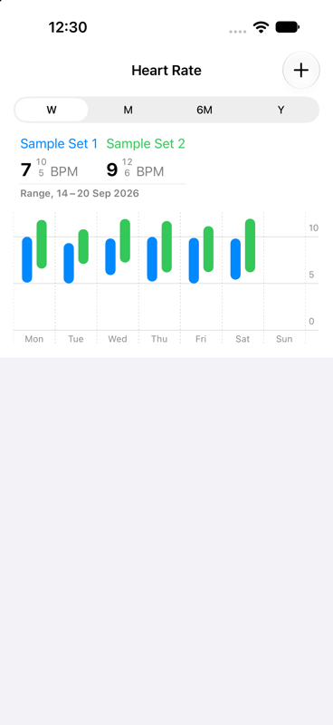
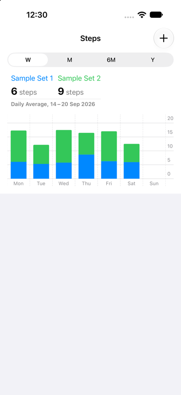
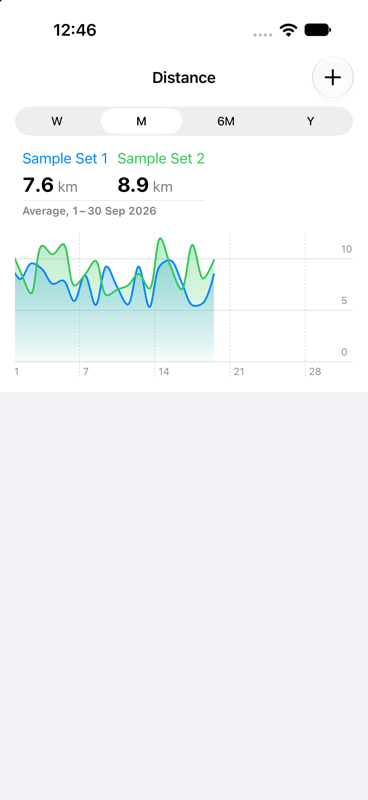
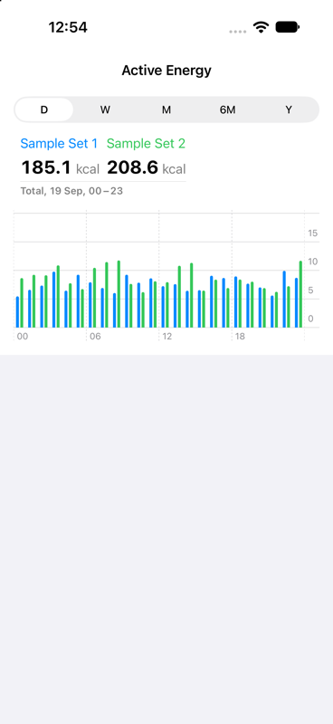
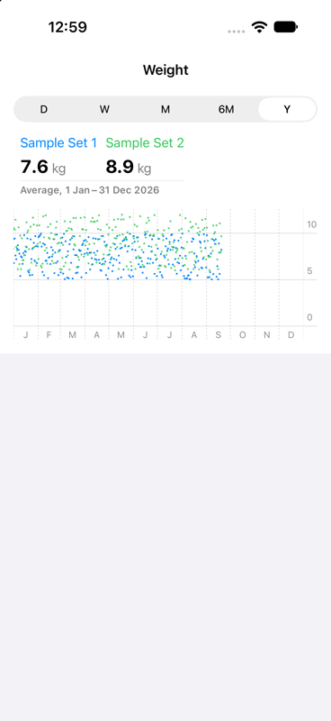

# QuickCharts

Health-style, scrolling time-series charts for SwiftUI. Hand a chart your readings and it gives you the whole Apple Health experience:
- a range picker (D / W / M / 6M / Y)
- a live summary header
- paged horizontal scrolling that snaps to days, weeks and months
- press-and-hold selection with a callout

Every part can be configured.

<p>
  
  
  
</p>
<p>
  
  
  
</p>

## Features

- **Seven chart types:** line (with an optional band), bar, stacked bar, area, range, scatter and step.
- **Five ranges:** a day with hourly buckets, a week, a month, six months with weekly buckets, and a year with monthly buckets. You choose which ones each chart offers.
- **Aggregation:** readings are averaged, totalled, spanned (lowest to highest) or left raw. The header can show the range's figure or the daily average, like Health's steps.
- **Built for large histories:** only a few screens of data around the visible range are bucketed and plotted, and scrolling doesn't redraw the chart on every frame.
- **Health-style screen:** `ChartScreen` puts the chart in an edge-to-edge top section whose colour carries on up behind the navigation bar, even when you pull down.
- **Live data:** pass new data in and the chart redraws, keeping its range and scroll position.
- **Accessibility:** a VoiceOver audio graph and data table, and header figures read as sentences.
- **Tested:** unit tests cover the aggregation, bucketing, calendar and wording logic, including daylight-saving weeks and 12- and 24-hour locales.

## Requirements

- iOS 18 or later
- Xcode 26 or later (Swift tools 6.2)

## Installation

Add the package with Swift Package Manager.

- **In Xcode:** choose **File › Add Package Dependencies…** and enter `https://github.com/andrewcoyle1/QuickCharts`.
- **In a `Package.swift`:**

  ```swift
  dependencies: [
      .package(url: "https://github.com/andrewcoyle1/QuickCharts", from: "0.1.0"),
  ],
  targets: [
      .target(name: "MyApp", dependencies: ["QuickCharts"]),
  ]
  ```

## Quick start

```swift
import QuickCharts
import SwiftUI

struct StepsView: View {
    let steps: [TimeSeries]

    var body: some View {
        NavigationStack {
            ChartScreen(title: "Steps") {
                BarChart(
                    data: steps,
                    configuration: ChartConfiguration(
                        aggregation: .sum,
                        summary: .dailyAverage,
                        unit: "steps",
                        valueFormat: .number.precision(.fractionLength(0)),
                        goal: 10_000
                    )
                )
            }
        }
    }
}
```

## Data

A chart takes one or more `TimeSeries`. Each is a named set of readings, with an optional band.

```swift
let heartRate = TimeSeries(
    name: "Resting",
    data: readings.map { TimeSeriesDatapoint(date: $0.date, value: $0.bpm) }
)

// A band, e.g. an error margin, drawn behind a line chart's line:
let weight = TimeSeries(name: "Weight", data: points)
    .withBand { ($0.value - 0.5)...($0.value + 0.5) }
```

- **Order:** readings can be in any order.
- **Names:** each series' name labels it in the header and callout, and also identifies it, so keep names unique within a chart.
- **Threads:** the model types are `Sendable` and `nonisolated`, so you can build them on any thread, such as in a HealthKit query's completion handler.

Charts pick up new data passed to them later, keeping the selected range and scroll position:

```swift
@State private var data: [TimeSeries] = []

var body: some View {
    LineChart(data: data)
        .task { data = await loadReadings() }
}
```

## Chart types

| Chart | Draws | Typical data |
|---|---|---|
| `LineChart` | A smoothed line per series, with its band shaded behind it | Averages with an error margin |
| `BarChart` | A bar per bucket, series side by side | Exercise minutes, daily totals |
| `StackedBarChart` | One bar per bucket, series stacked. Defaults to `.sum` | Active + resting energy |
| `AreaChart` | A filled area per series, fading towards the bottom | Distance, cumulative values |
| `RangeChart` | A capsule from each bucket's lowest to highest reading. Always uses `.range` | Heart rate |
| `ScatterChart` | Every raw reading, centred in its day. Always uses `.none` | Weight, blood pressure |
| `StepChart` | A line that holds its value across each bucket | Targets, settings |

All of them share the same picker, header, scrolling, snapping, selection callout and axes, and all take `init(data:configuration:)`.

## Configuration

Every setting of `ChartConfiguration` has a default, so pass only the ones you need.

| Setting | Default | What it does |
|---|---|---|
| `aggregation` | `.average` | How readings are combined into each bucket and the callout: `.average`, `.sum`, `.range` or `.none` |
| `summary` | `.combined` | What the header shows: the readings on screen combined (`.combined`), or each day's figure averaged (`.dailyAverage`) |
| `unit` | none | Shown after each value, e.g. `"steps"` or `"BPM"` |
| `valueFormat` | one decimal place | How values are written in the header and callout |
| `availableScales` | all five | The ranges the picker offers, always in D, W, M, 6M, Y order. With only one, the picker is hidden |
| `initialScale` | `.week` | The range the chart opens on. If it isn't available, the chart opens on the first range that is |
| `seriesColors` | blue, green, orange, purple, pink | One colour per series, repeating if there are more series |
| `goal` | none | A dashed line with its value labelled on the y axis. The axis stretches to include it |
| `height` | 160 | The plot's height, not counting the picker and header |
| `accessibilityTitle` | none | What VoiceOver calls the chart |

Some data doesn't suit every range. For example, a weight trend with one reading a day has nothing to show on D:

```swift
ScatterChart(
    data: weight,
    configuration: ChartConfiguration(unit: "kg", availableScales: [.week, .month, .sixMonths, .year])
)
```

The configuration is read once, when the chart first appears. To change it later, give the chart a new `.id(…)`.

## Screens

`ChartScreen` lays a chart out like a Health detail screen:
- **Chart section:** the chart sits in an edge-to-edge top section, and that section's colour carries on up behind the navigation bar.
- **Further sections:** they follow below with the usual inset look.
- **Navigation stack:** put it in a `NavigationStack`.
- **Toolbar:** add toolbar items the usual way.

```swift
ChartScreen(title: "Steps") {
    StackedBarChart(data: steps)
} sections: {
    Section("Highlights") {
        Text("You walked more this week than last.")
    }
}
.toolbar {
    ToolbarItem(placement: .topBarTrailing) {
        Button("Add Data", systemImage: "plus") { … }
    }
}
```

To build your own layout with the same top colour, mark the view whose top edge the colour should reach with `.topFillEdge()`, and apply `.topFill(_:)` to the enclosing `List`.

## Accessibility

- **Audio graph and data table:** each chart provides both to VoiceOver, named by `accessibilityTitle`.
- **Header and callout:** each series in them is read as one sentence, for example "Resting, 62 BPM, from 55 to 71".
- **Reduce Motion:** the selection callout honours it.

## Platform notes

- **iOS 18–25:** a single list section's margins can't be changed before iOS 26. So `ChartScreen` places the chart in a full-width section header instead, measuring the margin it needs to widen past. The screen looks the same as on iOS 26.
- **Bars, ranges and centred points:** on iOS 18, Swift Charts' fast whole-series plots crash at layout if given a bucket `unit:`. So bars and range capsules are drawn one mark per bucket. That's a few hundred marks at most, since only the loaded range is plotted.

## Previews and sample data

`TimeSeries.samples(readingsPerDay:)` returns two random series covering the past year, and `TimeSeries.mock(…)` returns one. Both are meant for previews and demos:

```swift
#Preview {
    NavigationStack {
        ChartScreen(title: "Heart Rate") {
            RangeChart(data: TimeSeries.samples(readingsPerDay: 12))
        }
    }
}
```

## Development

- **Tests:** the package builds for iOS only, so run its tests on a simulator:

  ```sh
  xcodebuild test -scheme QuickCharts -destination 'platform=iOS Simulator,name=iPhone 16'
  ```

- **Previews:** each chart type's file has a SwiftUI preview built from the sample data, which is the quickest way to try changes.

## License

QuickCharts is available under the MIT license. See [LICENSE](LICENSE).
